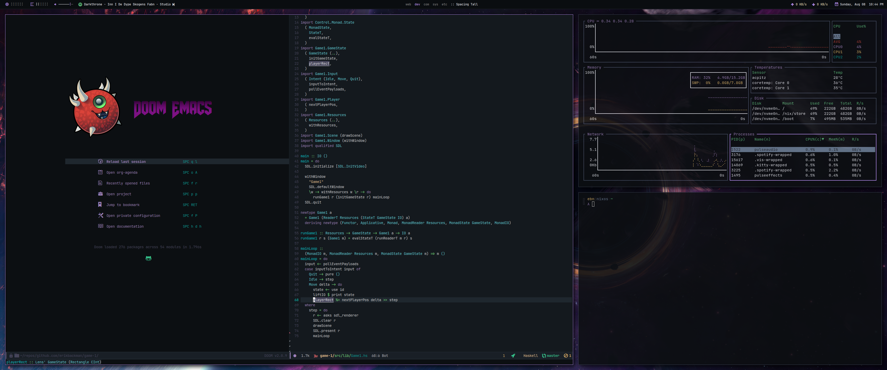

# My NixOS Configuration

**Current screenshots**

**Old screenshots**

|            |                |
|------------|----------------|
| *OS*       | NixOS          |
| *Shell*    | bash           |
| *Terminal* | Kitty          |
| *WM*       | xmonad         |
| *Font*     | JetBrains Mono |
| *Editor*   | Emacs          |
| *Top*      | Bottom         |
